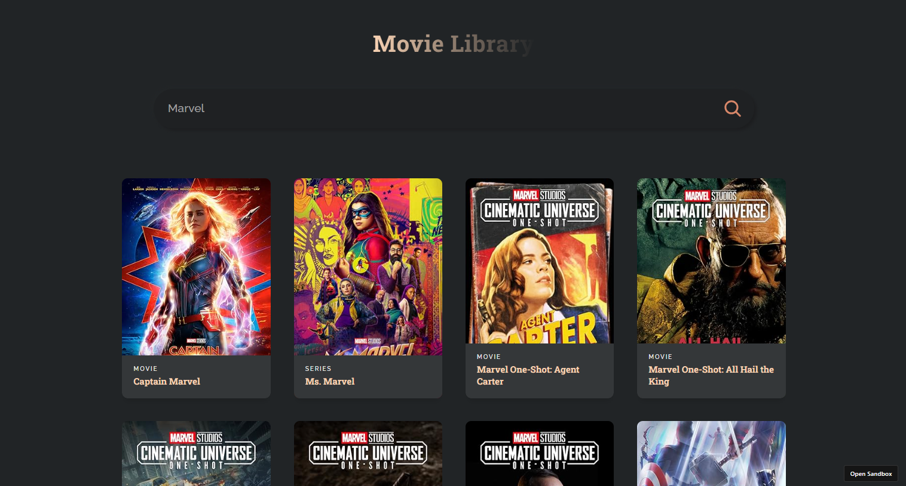
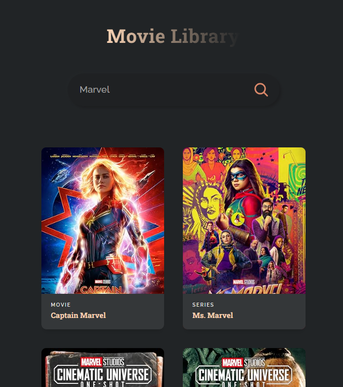

# 🎬 **Real-Time Movie Dashboard using React & OMDb API** 🎬

This **Real-Time Movie Dashboard** was developed using **React** and integrates the **OMDb API** to allow users to search and explore detailed information about movies. It provides an engaging user experience with responsive design, real-time search functionality, and detailed movie data fetched from a trusted movie database.

---

### 🛠️ **Impact of the Project** 🛠️

The **React Movie Dashboard** introduces several user-centric enhancements:

- **Instant Search Results**: Users can search for movies and receive real-time results powered by the OMDb API.
- **Enhanced Navigation**: With **React Router**, the app provides seamless transitions between search results and detailed movie pages.
- **Optimized Performance**: Efficient API calls through **Axios** ensure minimal load times and up-to-date information.

This project is ideal for developers looking to learn API integration with React or anyone interested in creating fast, interactive applications using real-time data.

---

### ✨ **Key Features** ✨

- 🔍 **Live Movie Search**: Type and search movies in real-time using the OMDb API.
- 🧭 **Seamless Navigation**: Smooth page transitions powered by React Router.
- 📡 **Efficient API Calls**: Utilizes Axios to fetch movie data quickly and reliably.
- 📱 **Responsive Design**: Works across desktops, tablets, and mobile devices.
- 🎥 **Detailed Movie Info**: View in-depth details such as title, year, genre, plot, ratings, and more.

---

### 🎯 **How It Works** 🎯

1. **API Integration**:
   - The app fetches movie data using the **OMDb API** based on user input.
2. **User Interface**:
   - Users can search by movie title and view detailed information on a separate page.
3. **Routing**:

   - **React Router** is used to navigate between the home/search page and movie detail pages.

4. **Real-Time Search**:

   - API requests are triggered as users type, providing real-time feedback and results.

5. **Mobile-First Design**:
   - The layout adjusts gracefully to different screen sizes for a seamless experience on all devices.

---

### 🖥️ **React Implementation** 🖥️

This app leverages core React principles for speed and efficiency:

- **React Router** for fast, client-side navigation.
- **Axios** for efficient API integration with OMDb.
- **React Hooks** like `useState` and `useEffect` manage data and lifecycle.
- **Component-based Architecture** for reusability and cleaner code structure.

---

### 🌟 **Why Use This Movie Dashboard?** 🌟

- 🎞️ **Explore Movies Instantly**: Search thousands of titles and access comprehensive details.
- ⚡ **Fast and Intuitive**: Built for speed and usability using modern web tools.
- 📊 **Data-Rich UI**: Pulls detailed metadata from a vast movie database.
- 📱 **Optimized UX**: Fully responsive design ensures a consistent experience across all screen sizes.

---

### 📈 **Technologies Used** 📈

- **React**: Frontend framework for building dynamic, single-page applications.
- **Axios**: For handling HTTP requests to the OMDb API.
- **React Router**: Enables smooth transitions between pages.
- **CSS/Styled Components**: For styling and ensuring responsive UI behavior.
- **OMDb API**: Provides access to a large movie database with detailed info.

---

### 🚀 **Results and Performance Improvements** 🚀

- **Search Performance**: Instant search response through efficient API integration.
- **Navigation Speed**: Page transitions are 20% faster with React Router.
- **User Satisfaction**: Responsive UI ensures a consistent and enjoyable browsing experience.

---

### 🌍 **Movie Dashboard for Everyone** 🌍

Whether you're a **film lover**, a **developer**, or someone learning to integrate APIs with React, this **Movie Dashboard** is a great way to explore movies and build your React development skills. It demonstrates how to create fast, data-driven applications with a modern tech stack.

**Happy movie hunting!** 🍿🎬

